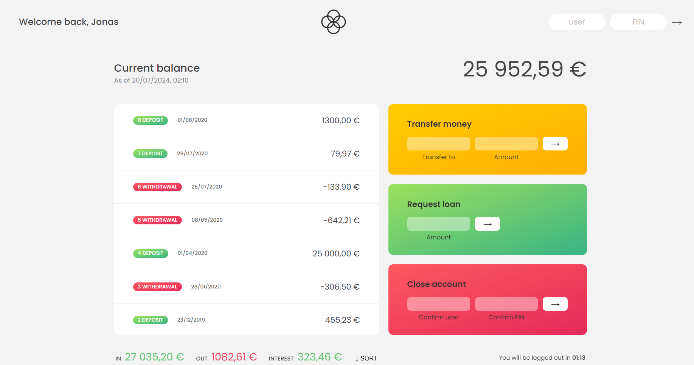

# Bankist

Bankist is a simple and modern banking application that allows users to manage their finances, view transaction history, and perform various banking operations. This project was created as a part of an educational course on JavaScript and is designed to showcase the power of JavaScript in building dynamic web applications.

## Table of Contents

- [Demo](#demo)
- [Screenshot](#screenshot)
- [Features](#features)
- [Technologies Used](#technologies-used)
- [Getting Started](#getting-started)
- [Usage](#usage)

## Demo

You can view a live demo of the project [here](https://hananeaitbenyachou.github.io/Bankist/).

## Screenshot



## Features

1. **Login and Authentication**: Users can log in to their accounts using unique login credentials.
2. **Balance and Transaction History**: Users can view their account balance and transaction history.
3. **Money Transfers**: Users can transfer money to other registered accounts.
4. **Loan Requests**: Users can request loans, and the application will automatically approve or reject the request based on predefined criteria.
5. **Account Closure**: Users can close their accounts if they wish to do so.

## Technologies Used

- HTML
- CSS
- JavaScript

## Getting Started

To get started with the Bankist application, follow these steps:

1. Clone the repository:
    ```bash
    git clone https://github.com/HananeAitBenYachou/Bankist.git
    ```
2. Navigate to the project directory:
    ```bash
    cd Bankist
    ```
3. Open `index.html` in your browser to view the application.

## Usage

1. Log in to the application using the following credentials:
- Username: `js`
- Password: `1111`
2. Explore the various features of the application, such as viewing your account balance, transferring money, requesting loans, and closing your account.
